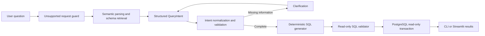

# Telecom Text-to-SQL Assistant

A clarification-aware, read-only Text-to-SQL application for a PostgreSQL
telecom database. Users can ask questions in everyday language, review the
generated SQL, and inspect or download the query results through a Streamlit
chat interface or a terminal client.

The project uses a hybrid approach: deterministic semantic rules handle
well-defined supported language, while a selectable Ollama or Gemini provider
supports schema retrieval, reranking, and structured intent extraction for
broader phrasing.
SQL is generated from a validated structured intent instead of being executed
directly from free-form model output.

## Highlights

- Natural-language counts, filters, grouping, aggregation, percentages, and
  ranking queries
- Schema-aware joins across customer, service, status, location, and
  population data
- Singular/plural and informal paraphrase handling
- Multi-turn clarification for genuinely missing thresholds or business
  definitions
- Preservation of previously resolved information across clarification turns
- Conditional grouped counts that retain categories with zero matches
- Read-only request guard, SQL validation, and PostgreSQL transactions
- Streamlit chat interface with SQL inspection and complete CSV downloads
- Terminal interface and reusable Python pipeline
- Unit, semantic regression, safety, and database result-equivalence tests

## Example questions

Clear analytical questions:

```text
How many customers are on each type of contract?
Show customers with monthly charges above 100.
Give me the top 3 clients by total revenue.
Show the average customer tenure for each customer status.
What percentage of customers have internet service?
Which city has the fewest churned customers?
```

Questions requiring clarification:

```text
Show loyal customers.
Find customers with a high churn score.
Which contract is performing best?
Find young customers who spend a lot.
```

For example, `Find young customers who spend a lot` can be resolved over two
turns: first define the age threshold, then define the spending metric and
threshold. The system preserves the first answer while resolving the second.

## How it works



The main stages are:

1. Reject predictive, destructive, administrative, credential, and obvious
   prompt-injection requests before model or database access.
2. Parse supported explicit language deterministically. For broader language,
   retrieve relevant schema columns with embeddings, rerank them, and ask the
   local model for structured JSON—not SQL.
3. Normalize high-confidence semantics such as grouping phrases, comparison
   wording, telecom synonyms, singular/plural concepts, and tenure units.
4. Validate the structured intent and ask a contextual clarification question
   only when required information is missing.
5. Generate SQL from the completed intent, determine only the required tables,
   and construct the necessary joins.
6. Validate that the SQL is one safe `SELECT` statement, then execute it inside
   a PostgreSQL read-only transaction.

## Technology

- Python 3
- PostgreSQL
- Ollama with `llama3.2` and `nomic-embed-text` for local development
- Gemini chat and embeddings as the hosted deployment option
- Pydantic for typed intent models
- Psycopg 3 for PostgreSQL access
- Streamlit and pandas for the browser interface
- `unittest` for deterministic tests

## Database schema

The application works with five related tables:

- `demographics`: customer identity, age, gender, marriage, and dependents
- `services`: tenure, internet service, contract, payment, charges, and revenue
- `status`: customer status, churn, satisfaction, churn score, and CLTV
- `location`: city, ZIP code, and coordinates
- `population`: population by ZIP code

Customer tables join through `customer_id`; location joins to population
through `zip_code`. The exposed semantic boundary is documented in
[SUPPORTED_QUESTIONS.md](SUPPORTED_QUESTIONS.md).

## Project structure

```text
telecom-text-to-sql/
|-- streamlit_app.py                 # Browser interface
|-- text_to_sql.py                   # Terminal interface
|-- telecom_text_to_sql/             # Production package
|   |-- pipeline.py                  # End-to-end orchestration
|   |-- request_guard.py             # Unsupported request rejection
|   |-- schema_metadata.py           # Semantic column descriptions
|   |-- schema_retriever.py          # Embedding retrieval and reranking
|   |-- semantic_parser.py           # Deterministic supported-language parser
|   |-- intent_parser.py             # Typed intent model and LLM parser
|   |-- intent_normalizer.py         # Semantic normalization
|   |-- intent_validator.py          # Completeness checks
|   |-- intent_resolver.py           # Multi-turn clarification resolution
|   |-- sql_generator.py             # Intent-to-SQL compiler
|   |-- sql_validator.py             # Read-only SQL safety checks
|   |-- query_executor.py            # Read-only PostgreSQL execution
|   `-- ui_controller.py             # Framework-independent chat state
|-- scripts/
|   |-- import_data.py               # Excel-to-PostgreSQL importer
|   `-- inspect_data.py              # Dataset inspection utility
|-- tests/                            # Unit and regression tests
|-- evaluation/                       # End-to-end cases and release gate
|-- DEPLOYMENT.md                     # Detailed deployment and verification notes
|-- PROJECT_JOURNEY.md                # Easy-language development and interview guide
|-- requirements.txt
`-- .env.example
```

## Local setup

### 1. Clone the repository

```powershell
git clone https://github.com/Mahmudul22473812/telecom-text-to-sql.git
cd telecom-text-to-sql
```

### 2. Create and activate a virtual environment

```powershell
py -3 -m venv .venv
.\.venv\Scripts\Activate.ps1
```

### 3. Install Python dependencies

```powershell
py -3 -m pip install -r requirements.txt
```

### 4. Install the local models

Install and start [Ollama](https://ollama.com/), then run:

```powershell
ollama pull llama3.2
ollama pull nomic-embed-text
```

### 5. Configure PostgreSQL

Copy the example environment file:

```powershell
Copy-Item .env.example .env
```

Set the real database values in `.env`:

```dotenv
DB_NAME=telecom
DB_USER=postgres
DB_PASSWORD=your_password
DB_HOST=localhost
DB_PORT=5432
```

The `.env` file is ignored by Git. Never commit database credentials.

The importer creates the application tables and indexes when they do not
already exist.

### 6. Import the dataset

Place the five telecom Excel workbooks in `data/`, then run:

```powershell
py -3 scripts\import_data.py
```

## Run the application

### Browser interface

```powershell
py -3 -m streamlit run streamlit_app.py --server.address localhost
```

Open `http://localhost:8501` if the browser does not open automatically.

The interface provides:

- multi-turn chat and clarification;
- row count, column count, and latency information;
- a display-only row selector that does not alter SQL semantics;
- generated SQL and query details;
- complete-result CSV downloads;
- clear-conversation and cancel-clarification controls.

### Terminal interface

```powershell
py -3 text_to_sql.py
```

### Programmatic interface

```python
from telecom_text_to_sql import run_pipeline

result = run_pipeline(
    "How many customers are on each contract type?",
    execute=True,
)

if result.status == "success":
    print(result.sql)
    print(result.columns)
    print(result.rows)
elif result.status == "needs_clarification":
    print(result.clarification_questions[-1])
else:
    print(result.error or result.sql_validation_errors)
```

Pipeline statuses are `success`, `needs_clarification`, `unsupported`,
`sql_rejected`, and `error`.

## Public deployment

The repository supports a low-change portfolio deployment using hosted
PostgreSQL, Gemini, and Streamlit Community Cloud. Local development still
defaults to Ollama, while production selects Gemini through environment
variables. The deployed public Streamlit URL can be embedded into a Vercel
website with an iframe.

See [DEPLOYMENT.md](DEPLOYMENT.md) for the complete Neon migration, read-only
database-role setup, Streamlit secrets, cloud verification, and Vercel embed
instructions.

## Testing and evaluation

Run the deterministic suite:

```powershell
py -3 -m unittest discover -s tests -v
```

Run the clarification benchmark:

```powershell
py -3 evaluation\evaluate_clarification.py
```

Run the complete three-pass database evaluation:

```powershell
py -3 evaluation\evaluate_end_to_end.py --runs 3
```

The comprehensive matrix contains 83 scenarios covering clear questions,
ambiguous questions, multi-turn resolution, filters, comparisons, grouping,
aggregations, rankings, percentages, joins, paraphrases, and unsafe requests.
The evaluator compares generated results with reference SQL executed against
PostgreSQL; it does not rely only on SQL-string matching.

The release gate measures:

- clear-versus-ambiguous classification;
- clarification precision, recall, and F1;
- case pass rate and database execution accuracy;
- SQL validity and runtime failures;
- unsafe rejection and safe acceptance;
- stability across repeated runs;
- mean and p95 latency.

Generated reports are written to `evaluation/reports/` and ignored by Git
because they depend on the local model and database environment.

## Safety model

Safety is applied at several layers:

- unsupported or malicious requests are rejected before intent parsing;
- generated SQL must begin with `SELECT` and contain only one statement;
- data-changing and administrative keywords are rejected;
- unsafe PostgreSQL file, configuration, sequence, lock, and backend functions
  are rejected;
- `SELECT INTO` and row-locking clauses are rejected;
- SQL is validated again immediately before execution;
- PostgreSQL execution uses `SET TRANSACTION READ ONLY`.

For a real deployment, the PostgreSQL account should also have database-level
read-only permissions. Application checks are additional safeguards, not a
replacement for least privilege.

## Current limitations

- The verified contract is intentionally limited to descriptive telecom
  analytics over the exposed schema.
- Predictions, future explanations, mutations, administration, secrets, and
  unsupported SQL patterns are rejected.
- Arbitrary subqueries, window functions, complex `OR` logic, `HAVING`, and
  unverified multi-metric reports are outside the current contract.
- Local mode expects PostgreSQL and Ollama to be running. Hosted mode requires
  valid remote-service credentials.
- The included public setup is intended for a portfolio demonstration. A
  higher-traffic production service still needs centralized rate limiting,
  authentication, usage monitoring, and automated backups.
- The cloud provider may interpret untested free-form wording differently from
  the locally evaluated model, so the database-backed gate must be rerun after
  changing providers.
- Passing the evaluation matrix demonstrates behavior within the tested
  contract; it does not guarantee correctness for every possible sentence.

## Additional documentation

- [Project journey and interview guide](PROJECT_JOURNEY.md)
- [Supported question contract](SUPPORTED_QUESTIONS.md)
- [Deployment and release checks](DEPLOYMENT.md)
